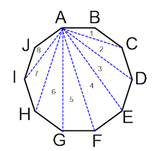

# Geometria

## Operações


## Dot Product - Produto Escalar (.)
É definido como o módulo da projeção de um vetor em outro.
Toma dois vetores e devolve um escalar como resultado.

Por exemplo, tomando os vetores
```
v1 = {x1, y1} e v2 = {x2, y2}
```
Temos:
```
v1.v2 = x1*x2 + y1+y2
```

Um produto escalar entre os vetores p e q pode ser definido como:
```
p . q = |p|*|q|*cos(angulo)
```

Perceba que, como é utilizado o cosseno, não fará diferença a orientação escolhida para o cálculo dele: `(p.q = q.p)`. <br>
Analisando o cosseno, sabemos que:
- Se p.q > 0, então o angulo é menor que 90 graus.
- Se p.q < 0, então o angulo é maior que 90 graus
- Se p.q = 0, então o angulo é igual a 90 graus.

Valem as propriedades (facilmente demonstráveis) <br>
- `a.(b+c) = a.b + a.c`
- `a.a = |a|²`

## Cross Product - Produto Vetorial (X)
É definido como o vetor perpenticular ao produto de ambos os quais o produto é feito, sendo o seu tamanho igual à área que o paralelogramo entre os vetores é formado. <br>
<center>  <br>

Pode ser representado pela determinante da matriz cujos coeficientes são os vetores, por exemplo, v1 = {x1, y1} e v2 = {x2, y2}:
<center>

|x1 y1| <br>
|x2 y2| 

</center>

Que é:
```
v1 X v2 = x1*y2 - y1*x2
```
Outro modo de denotar o produto vetorial é:
```
v1 X v2 = |v1|*|v2|*sen(angulo v1->v2)
```

Perceba que agora o ângulo faz diferença, já que este vai alterar o sentido do vetor do resultado. <br>
Analisando pelo seno, sabemos então, já que os módulos são sempre positivos, que o produto vetorial entre dois vetores p e q será:
- Se p X q > 0, então o angulo é menor que 0 graus.
- Se p X q < 0, então o angulo é maior que 0 graus.
- Se p X q = 0, então o angulo é igual a 0 graus, logo os vetores são paralelos.

O que pode ser usado, por exemplo, para saber a orientação entre dois vetores, para saber se um poligono é convexo. <br>

### Cálculo de Área de um Poligono Convexo
Perceba que, à partir de qualquer ponto de um polígono convexo, de acordo com a sua própria definição, é possível traçar uma reta até qualquer um de seus outros vértices, formando triangulos, como na figura abaixo.
<p>
<center>

</center>
</p>

Como o produto vetorial entre dois vetores, em módulo, retorna a área do paralelogramo que seria formado por eles, isso significa que o produto vetorial dividido por 2 é a área do triângulo que divide o paralelogramo ao meio. <br>
Voltando à figura acima, podemos, por exemplo, calcular a área do triângulo formado pelos vetores AB, BC e AC, tomando o produto vetorial AB X BC / 2.
Assim, fazendo sucessivamente o mesmo com os triângulos de 1 a 8, somando as áreas temos a área total do polígono.
